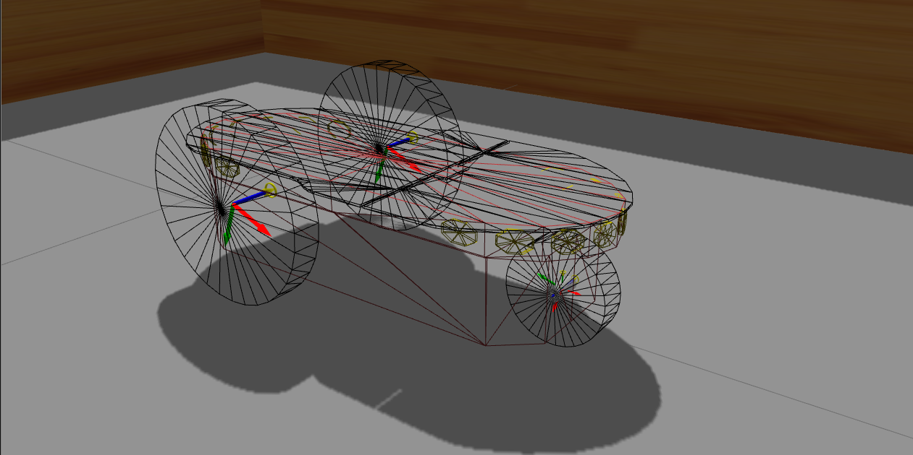

## **Description**
A tricycle robot, named ebot, navigation project on gazebo

<p align="center">
 
</p>

The robot is a wheeled tricycle mobile platform with a single actuated front wheel and steering where center of rotation of both coincidents, and two back wheels are non-actuated. The robot's center of body is located at middle point of the rear axis, in between the two back wheels.

Robot odometry is being calculated using a modified version of tricycle plugin libgazebo_ros_tricycle_drive (Marcus Bader). For mapping, localization and path planning; gmapping, AMCL and Timed elastic band planner methods were used respectively and the configuration parameters were tuned heuristically.

### **Installation** 
Download this package to the _src_ folder of your ROS workspace

```git clone https://github.com/kuralme/tricyclebot_ebot```


### **Instructions**
- To run the complete simulation of a robot following the path through pre-determined waypoints:\
  ```roslaunch ebot_description ebot.launch```\
  ```roslaunch ebot_description path_follow.launch```


- Gazebo simulation only:
  ```roslaunch ebot_gazebo ebot_world.launch```

- Mapping:
  ```roslaunch ebot_description ebot_mapping.launch```

- Keyboard teleop:
  ```rosrun ebot_navigation ebot_teleop.py```

- Save the map:\
  ```roscd ebot_navigation/maps```\
  ```rosrun map_server map_saver -f my_map```
  
### **Dependencies**
TEB local planner
```sudo apt-get install ros-<dist>-teb-local-planner```

Also, give permission to execute if navigation script(ebot_nav) doesn't work.

### **Demo video**
https://youtu.be/ySX_F9NLxns

### TODOs ###

- [x] Fine-tune planner parameters for better maneuvering
- [ ] Change odometry method to 'encoder' instead of 'world'
